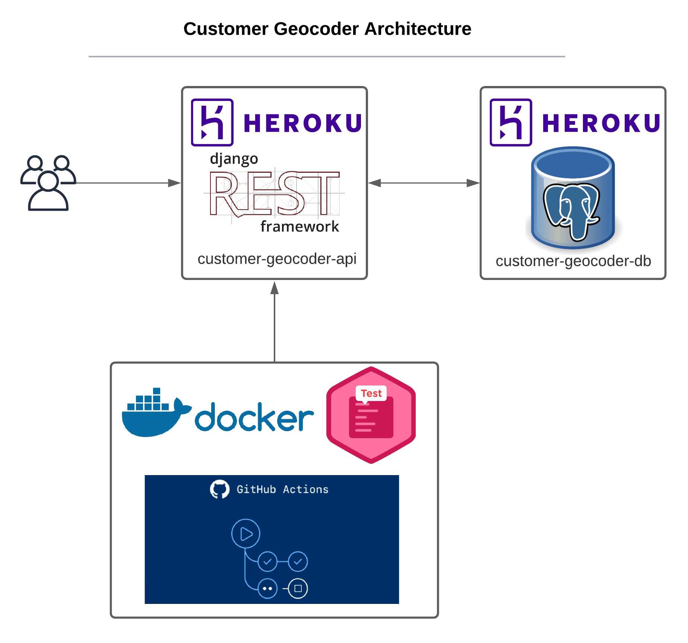

# customer geocoder

Django REST API which provides information about customers. Built with Django Rest Framework, Swagger, Postgresql, Heroku and Github Actions.

## Development

- If using vscode, a `devcontainer` configuration for local development is available.
- The geocoding method uses the `Google Maps API`. To setup the API KEY, visit: <https://developers.google.com/maps/documentation/geocoding/overview>

## Deploy

To setup the app for the first time, do the following:

- Create the heroku app: `$ heroku create <app-name>`
- Configure the following environment variables
  - Set the django secret key: `$ heroku config:set SECRET_KEY=<some-secret-key>`
  - Add the heroku app url to allowed hosts: `$ heroku config:set DEPLOY_HOST=<app-url>`
  - Set the environment to production: `$ heroku config:set PRODUCTION=1`
  - Add the database, also created database url: `$ heroku addons:create heroku-postgresql:hobby-dev`
- Configure heroku to deploy docker container: `$ heroku stack:set container`
- Add the heroku remote: `$ heroku git:remote -a <app-name>`
- Push the app to heroku: `$ git push heroku main`

Now that the app was created, we can populate the database

- Create migrations:
  - `$ heroku run python manage.py makemigrations`
  - `$ heroku run python manage.py makemigrations api`
  - `$ heroku run python manage.py migrate`
- Create a new super user: `$ heroku run python manage.py createsuperuser --email <email> --username <user>`
- Populate the database with the csv files:
  - There are 2 files, one with already geocoded.
  - If you want to use the geocoded file, run: `$ heroku run python manage.py customers_from_csv customers_geocoded.csv`
  - To use the geocoding method, set the GEOCODING_API_KEY env var: `$ heroku config:set GEOCODING_API_KEY=<your-api-key>`
  - Now run, the command, it will take a few seconds: `$ heroku run python manage.py customers_from_csv customers.csv --geocode`

After setting up everything, `Github Actions` will take care of deploying your app on new releases

Create the following secrets in your github repo:

- `HEROKU_EMAIL`: Your heroku email
- `HEROKU_APP_NAME`: The heroku app name
- `HEROKU_API_KEY`: An API key for your account. To create a new one, run: `$ heroku auth:token`
